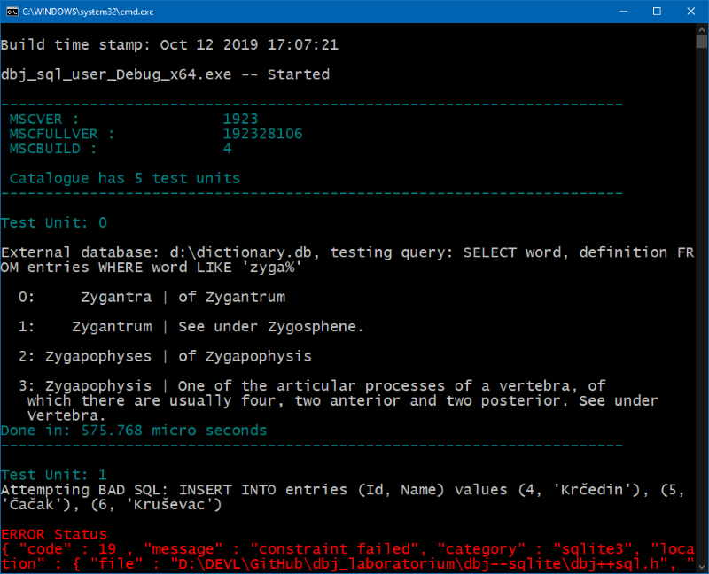

# dbj++nanolib&trade; 
&copy; 2019 by dbj.org

### Very opinionated and very small ISO C/C++ library. Testing, concepts, mechanisms. 

## General strategy

- role of C/C++ is "system programing"
    - C++ is *not* for "business logic" components"
    - think of the run-time environment
         - for example always assume "server side" run-time
           that means no console, syslog and such	     
- prefix is "Nano", keep that in mind
    - do not be affraid to "take things out"
        - for eaxmple DBJ++TU (unit testing) will be taken out into separate lib
- develop for constrained run-time environment
    - no exceptions
    - no STL
    - modern C as much as possible
    - C++17 
    - iostreams just when testing
    - develop console programs just for testing
       -- we use DBJ++TU
- for development use Windows and VisualStudio
    - dbj nano lib, is semi-portable portable. It is developed on Windows 10 PRO, using Visual Studio and Windows SDK, the latest.
    - use clang (packaged with VS) as much as possible

## The Purpose & Motivation
However small they might be, C/C++ programs should always promote good design, good implementation and high degree of reusability. Also, good coding solutions should not "get in the way". They should be small and transparent and comfortable to use, beside being resilient.

STL "out of the box" can not be used for Gaming, IoT, mission critical systems, medical systems and any other constrained run-times. Thus "DBJ Nanolib".

## Caveat Emptor

This is active project. This readme is forever shifting. This is not a product in the form of code library. Although it is very close. 

In case you want to contact me about transforming this library, or its part, to your DEVENV please do contact me and I might help. I will also respond to issues posted here. Time permitting.

## Modern C and C++

I am actively developing in C and C++ since 1992. C is a powerful beast living bellow. C++ is powerful and complex. One is never sure it is tamed. Stay alert, never turn your back to C++. The weeds of over engineering will very quickly stop your project and drag it to the bottom of the sea-of-redundant-code.

Part of the required self discipline is to constantly develop and use mature concepts, proven to work in real projects.  

#### But, why not just using `std::` lib? 

When runtime allows me to, I do indeed use the std lib. But std lib is designed to be general purpose. My key concepts are not over there. Neither are yours. Part of my responsibilities is to make sure organizations are adhering to rigour and method. Not just in Architecture (my primary role), but in developing , testing and delivering, what is architected, designed and finally developed.

In doing so, I know people are good and creative, thus I do not want to impose a lot of harhs discipline, rigour and method. My coding solutions tend to be more of an agreement than imposed and complex code. 

Modern, fancy keyword is "contract". `dbj++ Nanolib` is primarily an tiny universal contract. I might advise you to impose it on your projects.

### Top Level Library Organization (W.I.P.)

Diagram of the top level dependencies with some descriptions.


Please keep in mind however, the prefix "nano" (aka tiny). In future sequence of releases dbj++ Nano lib will grow. Hopefully not that match.

### How to use

Use the this repository as a git submodule. That is by far the most feasible way.

`dbj++nanolib` is primarily C++17, Windows only library. I use always, the latest Visual Studio reincarnation. This is primarily header only library.
There might be one or two c files though. Just add them to your projects to be compiled.

As per diagram above, one can include `dbj++nanolib.h` for the core functionality.

Or just `dbj++tu.h` for the testing framework, or just `dbj++valstat` to start using `valstat` and two valstat traits from there, to achieve consistent , simple and exception free, function returns. 

**Slight detour: Subset of UML**

Whatever you do, always plan and think about it beforehand. Use simple diagrams before deciding your design is complete and just then you can freely proceed onto the implementation.

Designs and diagrams are invaluable. First for explaining to yourself your solution, and second to make others understand your solution, before they loose the patience with you `¯\_(ツ)_/¯`

## What's inside

I see no much point of generating documentation from code, if code is available and properly commented. I tend to write a lot of comments.

Please just dive in and enjoy. At last this is made for you, not for someone needing a paper book to understand how to use the modern C/C++ library.

## what is 'dbj++nano play'

That is a twin project. We use it to test the quality of implementation and usability of the nanolib. That should be seen as used as "documentation" for dbj++nanolib.

Newcomers to `dbj++nanolib` should definitely start from dbj nano play, as the entry point. It will contain more and more tests to show how are the things from nanolib to be used.

Next I will just list and quickly describe, in random order, important things in the Nanolib. As per your demand this documentation will be more detailed as `dbj++nanolib` spirals through time.

Do not forget: code should be simple and headers manageable.

## dbj++nanolib.h

The library core header. Namespace is:  `dbj::nanolib`.

#### configuration

`#define DBJ_TERMINATE_ON_BAD_ALLOC` in order yor project, does not to throw `bad_alloc`, on heap memory exhausted. Instead, default termination will be called.
```cpp
  (std::set_new_handler([]{terminate();}););
```
For safe testing experience, `#define DBJ_SYNC_WITH_STDIO` in case of mixing `stdio.h` and `iostreams`.
```cpp
			ios_base::sync_with_stdio(true);
```
We use `iostreams`, only when testing. `dbj++tu.h` contains a tiny testing framework.

#### Unavoidable Macros

- macros are named starting with `DBJ...` or `_DBJ...`
 - `DBJ_REPEAT(N)` is interesting, there is no "do something N times" C++ keyword
 - the namespace is `dbj::nanolib`
  - most peculiar little thingy in there is perhaps `v_buffer`, because we do not want to use `std::string` as buffer, in core libraries (see Appendix A)
   - we use exclusively `std::vector<char>` as the char buffer in dbj++nanolib
   - `v_buffer` is actually a trait made to provide the required functionality for handling the `v_buffer::buffer_type`
  - Another peculiarity worth mentioning is we never use `printf`/`fprintf` naked but through  two variadic macros
    - DBJ_FPRINTF(...)
    - DBJ_PRINT(...)
    - Primarily because debug build versions do contain checking the returns of `std::fprintf`. If you have  been (and I was) ever beaten by not checking `stdio.h` functions return values, you will understand.  Invaluable even if it cathes a bug only once.

## dbj++tu.h

Fully functional Testing framework. namespace `dbj::tu`. Roadmap is to take it out in a separate lib. Thus all the testing now inside the nanolib will ba moved to the "playground".

It works as one might expect an C++ Testing Framework. You register the "Test Unit". It gets collected at compile time and executed at runtime.

Advisable to start understanding it, is to look at the bottom of the `dbj++valstat` header where one test resides. This is where you want to put your Visual Studio break point and hit F5, while in the [nano play project](https://github.com/dbj-systems/dbj--nanoplay).
```cpp
TU_REGISTER(
	[] {
    // the rest of the code
  });
```

Macro `DBJ_TX` is indeed using `iostreams`. That is ok in the context of testing apps. Makes for simpler and shorter testing macro. 

Lastly, to run the test units collected, on has to call the starting point, somewhere from the main():

`dbj::tu::catalog.execute()`

As expected for every decent testing framework, the coloured console output pops-up, and every TU is timed too. Like so.



# Appendix A
## Key concepts

What follow is the advice, I am advising you, not dictating. This is general C++ advice too.

### No sub-classing
- inheritance in C++ is used for
  - [Sub-Typing](https://en.wikipedia.org/wiki/Subtyping)
  - Sub-Classing
    - Sub-Classing is evil
- [Polymorphism does not require inheritance](https://en.wikipedia.org/wiki/Composition_over_inheritance)
  - Sub-classing inside the c++ std lib is very rare

### Optimise the std::string usage

Hint: do not use it.

- `std::string` is very versatile, but it is **not** made to be used as char buffer. 
  - it makes for one complex type and  large memory structure, too complex to act as a simple char buffer
  - example: `std::string` operator '+' is notoriously slow, thus people try and use the `append()` method, complicating the code.
  - it is more elegant and faster to do `sprintf` into the buffer, instead of using `std::string` append
  ```cpp
  // using std::string to compose a new string
  // need to use append() to avoid '+'
  std::string new_val(  reader->kv_map_[key].data()  );
  new_val.append("\n").append(value);

  // instead dbj nano lib offers an elegant replacement
  // example: append key, new line char and value and keep them in the buffer created
  	buffer_type new_val = buffer::format( "%s%c%s",
		reader->kv_map_[key].data() , '\n', value
	);
  ```
  Unless you are developing large and complex text processing code, be very modest with `std::string`.
### No throwing and catching

Hint: no exceptions

First, if your executable, is intended to operate under continuous uptime requirement, it should never fail and never exhibit undefined behavior. Thus, the error handling is of utmost importance. It has to be very resilient, simple, explicit and unforgiving. Some advice.

- throwing and catching do create slow applications, with many hidden paths of execution
- the raising of the error and handling the error raised, should be tightly coupled and at the same place in the source code. Make it easy to understand what happens if error happens.
  - if you need to throw an exception from a constructor, your design is wrong.
  - if your constructor is complex and might be source of operational error's consider factory functions or friends, whatever you fancy most.
  - however silly that looks to a C++ developer consider removing tricky destructors into static or friend functions to be called by some external deterministic mechanism, similar to the lock/unlock idiom.
  
  Exceptions ar proven to generate bigger and slower code. If still in shock please see the official C++ comitee [document on the subject](http://www.open-std.org/jtc1/sc22/wg21/docs/papers/2019/p1640r1.html).

### Avoid system error

Hint: do not use it.

- `std::system_error` is old, over-engineered design and somewhat poor implementation
- `std::system_error` was not designed to be universal error mechanism for C++ `std::` lib. Neither it was ever adopted or implemented, as such.
- it is not a replacement but consider using a POSIX subset: `std::errc` with `std::generic_category()`
- also, win32 errors are well implemented by MSVC and `std::system_category()`

If interested on actual reasong [please proceed here](http://www.open-std.org/jtc1/sc22/wg21/docs/papers/2018/p0824r1.html).

### Avoid c++ streams

Hint: use them only when testing and only in concole apps.

- C++ streams is old (ancient) complex design, too. 
- using `iostreams` creates large and slow applications
- if you need to do a lot of console output consider using the [fmt library](https://github.com/fmtlib/fmt).
     - Although, I am personally puzzled how is `fmt` better than `cstdio` functions
     
> Think. C and C++ are primarily used for server side modules. Thus, not console apps. Find and use good logging lib. In real life never (ever) write a server side module without using a [syslog](https://en.wikipedia.org/wiki/Syslog).      

### Standards
- use the latest and published ISO C++ version. 
  (hint: C++20 is not yet)
- use ISO C++ std lib as cautiously as possible (and run-time permitting)
- Do not lose your C experience. 
  - C is simple and makes you deliver things, instead of re-inventing things before delivering things. 
   - take same time to learn about [modern ISO C](https://gforge.inria.fr/frs/?group_id=6881). It has advanced. A lot.

## The final advice:

**This is "nano" lib. Before asking for adding anything to it, think.**

## Contact

In case you hotly dislike or just like my work, or anything in between, for what you might find interesting in here, please do write me:

[dbj@dbj.org](mailto:dbj@dbj.org)

## License

### CC BY-SA 4.0 -- https://creativecommons.org/licenses/by-sa/4.0/ 

---
[
 &copy; 2020](https://dusanjovanovic.org)


